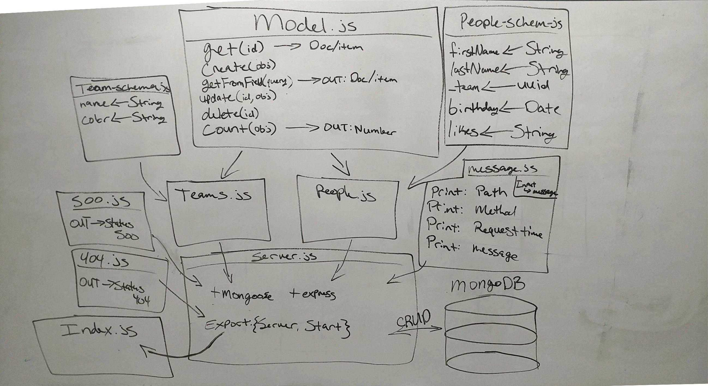

# LAB - 08

## Express

### Author: James Dunn

### Links and Resources

- [submission PR](https://github.com/james-401-advanced-javascript/lab-08/pull/1)
- [travis](https://travis-ci.com/james-401-advanced-javascript/lab-08)
- [front-end](https://jamesdunn-lab-08.herokuapp.com)

### Modules

#### `people-routes.js`

#### `team-routes.js`

#### `timestamp.js`

#### `message.js`

#### `404.js`

#### `500.js`

##### Exported Values and Methods

###### `create(item)`

###### `get(_id)`

###### `getByQuery(query)`

###### `update(_id, item)`

###### `getFromField(_id)`

###### `count(obj)`

### Setup

#### `.env` requirements

- `PORT` - 3000
- `MONGODB_URI`

#### Running the app

- `npm start`
- Endpoint: `index.js`

#### Tests

- How do you run tests?
- `npm test __tests__/server.test.js`

#### UML

